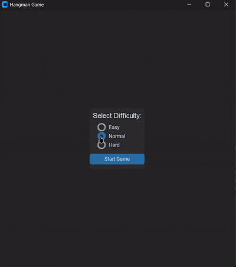

# 🕹️ Hangman Game with CustomTkinter


A modern, dynamic, and feature-rich Hangman game built with **Python** and [CustomTkinter](https://github.com/TomSchimansky/CustomTkinter). Dive into a responsive GUI experience with difficulty levels, per-guess timers, and persistent player records!



---

## 🚀 Features

- 🎯 **Difficulty Levels**: Choose from **Easy (8 attempts)**, **Normal (6 attempts)**, or **Hard (5 attempts)** to match your skill.
- ⏱️ **Per-Guess Timer**: You have **10 seconds** to enter each letter. Miss your window and lose an attempt!
- 🎨 **Progressive Hangman Drawing**: See your hangman build stage-by-stage, only drawing the next piece for efficiency.
- ✅ **Input Validation**: Entry field restricts input to a **single alphabet character**, preventing invalid guesses.
- 🔄 **Reset Functionality**: Clear the canvas, restart timers, and reset all variables with one click.
- ✍️ **Guess History**: A dedicated label displays all previously guessed letters.
- 🏆 **Persistent Records**: Player performance (word, result, attempts left, difficulty, time taken, date) saved to `records.json`.

---

## 🛠️ Installation & Requirements

1. **Clone the repository**:

   ```bash
   git clone https://github.com/your-username/hangman_game.git
   cd hangman_game
   ```

2. **Install dependencies**:

   ```bash
   pip install customtkinter CTkMessagebox
   ```

3. **Run the game**:

   ```bash
   python hangman.py
   ```

---

## 📂 Project Structure

```
hangman_game/
├── hangman.py          # Main game script
├── records.json       # Auto-generated records file
├── README.md          # This documentation
└── assets/            # (Optional) images, icons
```

---

## 📸 Screenshots

*Select your difficulty and begin!*

*Watch the hangman draw and countdown timer in action!*

---

## ❤️ Contributing

1. Fork the repo
2. Create a branch: `git checkout -b feature/YourFeature`
3. Commit your changes: `git commit -m 'Add awesome feature'`
4. Push to branch: `git push origin feature/YourFeature`
5. Pull request!

---

